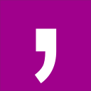

Passionate about computers from a young age, Kent started developing in BASIC on his family's Amstrad CPC 6180, which quickly led to writing Z80 assembly. His professional career has exposed him to a wide range of languages and platforms, including C#, Dart, .NET, Java, C, and F#. He's worked in a variety of sectors, including agriculture, superannuation, and finance - with both Agile and traditional Waterfall methodologies.

A [Microsoft MVP](https://mvp.microsoft.com/en-us/PublicProfile/4025178?fullName=Kent%20Cameron%20Boogaart) in Client Application Development between 2009-2018, and a [Xamarin Certified Mobile Developer](https://university.xamarin.com/certification) in 2016, Kent has been heavily involved in Xamarin development from 2012. He openly [designed and developed a complete application](https://github.com/kentcb/WorkoutWotch) for the benefit of the community, recording videos describing the process. As one of the core maintainers of the functional-reactive MVVM library, [ReactiveUI](http://reactiveui.net/), Kent authored and self-published a much-lauded [book on the subject](https://kent-boogaart.com/you-i-and-reactiveui/). Kent became very interested in [Flutter](https://flutter.dev/) in 2018, going on to develop several mobile applications with it, including one of his own, _Job Done_ (available on the [Play Store](https://play.google.com/store/apps/details?id=au.com.crosslinkbs.jobdone) and [AppStore](https://apps.apple.com/au/app/jobdone/id1463513891)).

Kent takes pride in his ability to communicate clearly and effectively with developers, users, and business stakeholders. He has often been complemented for bringing clarity to a previous quandary. His number one goal in any project is to delight the end user. Kent achieves this through deep thought and innovation - not satisfied until both simplicity and lucidity are attained. But at the same time a pragmatist, Kent dislikes spinning his wheels on any particular problem, preferring to return to it later once sufficient thought and context is established.

If you'd like to talk to Kent about making your project a success, you can contact him via [LinkedIn](http://www.linkedin.com/in/kent-boogaart-61951516) or [email](mailto:kent.boogaart@gmail.com).

     
