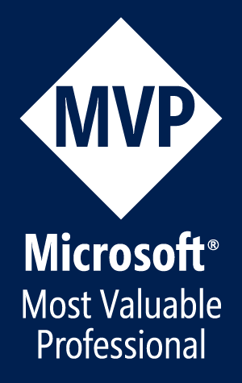

Kent began working with WPF when it was still in beta. His enthusiasm for providing users with intuitive and innovative solutions provided the initial impetus for investigating WPF. It didn't take long for him to develop a deep appreciation for the platform and its elegance. Within industries as varied as agriculture and finance, Kent has spear-headed the design and implementation of first-class WPF applications that deliver superior experiences to their users.

Kent's articles on WPF's `ItemsControl` were published in DNC Magazine's [July 2015](https://dncmagazine.blob.core.windows.net/annivedition/DNCMag-ThirdAnniv-Issue19.pdf) and [September 2015](https://dncmagazine.blob.core.windows.net/edition20/DNCMag-Issue20.pdf) editions. And he is one of the most prolific [answerers of WPF questions on Stackoverflow](http://stackoverflow.com/tags/wpf/topusers).

If you'd like to talk to Kent about making your WPF project a success, you can contact him via [LinkedIn](http://www.linkedin.com/in/kent-boogaart-61951516) or [email](mailto:kent.boogaart@gmail.com).

