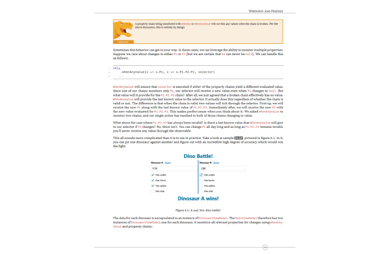
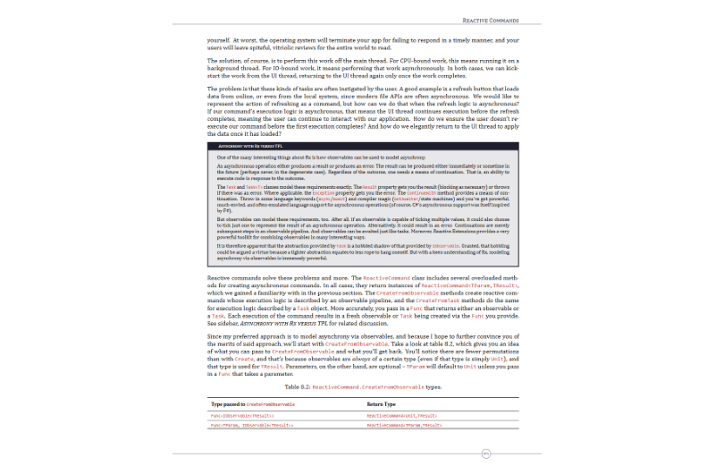

THIS IS A DRAFT

You, I, and ReactiveUI

Complex user interfaces, without code complexity

<ul class="isthisyou">
<li>Have you ever chased a bug for hours, only to discover the root cause is an innocuous looking piece of state?</li>
<li>Do you ever wonder whether there's a sane, elegant way to write code that ties together wildly disparate asynchronous data sources?</li>
<li>Have you ever guiltily omitted unit tests for time-sensitive code, simply because it was too hard to test?</li>
<li>Do you ever dream of writing the vast majority of your UI application code once, and then using that code to target totally unrelated platforms?</li>
</ul>

You, I, and ReactiveUI* is a comprehensive and enlightening book that will teach you how ReactiveUI can help solve all these problems and more. Beautifully typeset, and accompanied by an incredible set of code samples, it walks you through all of ReactiveUI's major features, describing how each can be used to level-up your .NET UI applications.

<!-- Book preview slideshow -->

  

    
1 / 10

    
  

  

    
2 / 10

    
  

  

    
3 / 10

    
  

  

    
4 / 10

    
  

  

    
5 / 10

    
  

  

    
6 / 10

    
  

  

    
7 / 10

    
  

  

    
8 / 10

    
  

  

    
9 / 10

    
  

  

    
10 / 10

    
  

Stop managing application state like a dinosaur and unleash the power of reactive programming on your user interfaces.

<button type="submit" name="buy" class="buybutton" data-label="BUY THIS BOOK">BUY THIS BOOK</button>

